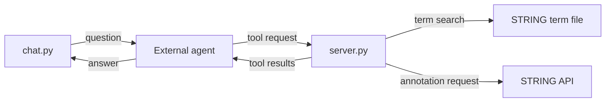

# ECCB MCP Workshop: Setup and Run

## Overview

This Codespaces setup runs the example MCP server and exposes it through a
public port. An external agent can query the server's tools, and `chat.py`
provides a simple terminal interface for chatting with that agent.



## 1. Initial setup (use Chrome browser for compatibility)

1. Open the project repository on GitHub.
2. Select **Code**, then **Codespaces**, then **Create codespace**.
3. Wait for the environment to finish building (you should see this README file in the main window).

## 2. Start the MCP server

Once setup is complete, start the MCP server:

```bash
./server.py >& server.log
```

The server output is written to `server.log`. It includes messages similar to:

```text
INFO:     Started server process [2464]
INFO:     Waiting for application startup.
INFO:     Application startup complete.
INFO:     Uvicorn running on http://127.0.0.1:8000 (Press CTRL+C to quit)
```

## 3. Make the port public

Once the environment is running:

- Open the **Ports** tab.
- Find port `8000`.
- Right-click the port, then select **Port Visibility** → **Public**.
- Right-click the port again, then select **Copy Local Address**. You will
  need it in the next step.

## 4. Configure the chat client

Click `chat.conf` in the left-hand file explorer and replace both placeholder values.
For `MCP_SERVER_URL`, paste the local address you copied in the previous step
and add `/mcp`:

```text
OPENAI_API_KEY="your-api-key-here"
MCP_SERVER_URL="<your-copied-local-address>/mcp"
```

Do not commit a real API key. Then return to this README.

## 5. Open a new terminal

Open the **Terminal** tab and click **+** to start a fresh terminal.

## 6. Open the server log

Click `server.log` in the left-hand file explorer and keep it open on the right. It shows errors and debug information from your MCP server.

## 7. Start the chat client and begin chatting

```bash
./chat.py
```

The chat client reads the server URL from `chat.conf` and sends tool requests to
the running `server.py` server. Its two example tools search Biological Process
descriptions in a flat file and retrieve annotations from an external API.

Example prompts:

- `Search the human Biological Process terms for cell cycle.`
- `What Gene Ontology Biological Process annotations does human CDK1 have?`

## Troubleshooting

- Ensure the server is fully running before starting `chat.py`.
- Ensure both values in `chat.conf` have been replaced before starting the chat client.
- If the endpoint fails, double-check the `/mcp` suffix.
